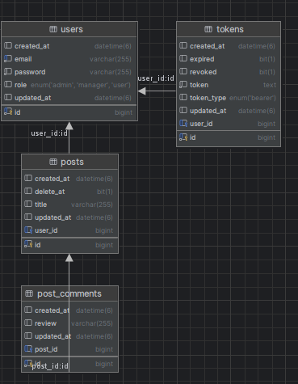

# Java Spring Boot Sample RESTful API

This project is a sample RESTful API developed with Java Spring Boot and MySQL, focusing on a case study of managing posts and comments. Users can create posts, comment on posts, and interact with the system using a robust authentication and authorization mechanism implemented with Spring Security and role-based access control.

- **Created by**: Budhi Octaviansyah
- **GitHub**: [https://github.com/budioct](https://github.com/budioct)
- **Email**: budioct@gmail.com

---

## Prerequisites

Ensure you have the following installed before running the project:
- **Java**: 21
- **Spring Boot**: 3.4.0
- **Spring Security**
- **JWT**
- **Spring Validation**
- **MySQL**
- **Maven**

---

## Entity Relationship Diagram (ERD)

<div align="center">

</div>

---

## Features

### User Management
- User registration
- User authentication (login)
- Password update
- Token-based refresh authentication
- User logout
- Retrieve user details via headers

### Post Management
- Create posts
- Update posts
- Delete posts
- Retrieve specific posts by ID
- Retrieve all posts with optional pagination

### Comment Management
- Create comments
- Update comments
- Delete comments
- Retrieve specific comments by ID
- Retrieve all comments with optional pagination

### Error Handling
- Comprehensive custom exception handling
- Errors returned in a structured JSON format for better API consumption

---

## Installation

1. Clone the repository:
   ```bash
   git clone https://github.com/budioct/simple_rest_java_springboot.git
   ```
   
2. Create Mysql database
   ```bash
   create database learning_rest_new
   ```

3. Navigate to the project directory:
   ```bash
   cd simple_rest_java_springboot
   cd simple_rest_java_springboot/ 
   cd .\simple_rest_java_springboot\
   ```
4. Change mysql username and password as per your installation
+ open `src/main/resources/application.properties`
+ change `spring.datasource.username` and `spring.datasource.password` as per your mysql installation


5. Build .jar using Maven
   ```bash
   mvn clean compile test package
   ```

6. Build and run spring boot application
   ```bash
   mvn spring-boot:run
   ```

7. The application will run on http://localhost:8080

---

### API Documentation

API documentation is available via Postman. You can access it here: 
- Postman Documentation: https://documenter.getpostman.com/view/7284698/2sAYBd8UM9
- Additionally, a Postman collection file is included in the repository under docs/Documentation REST API Spring Boot.postman_collection.json.

---

### Thank you for taking the time to explore this project. I hope it serves as a helpful resource in your journey to mastering Java and Spring Boot development. Your feedback and contributions are always welcome.

### Wishing you success in your development endeavors. May this project inspire and support you in building even greater solutions.

### Best regards,  
### Budhi Octaviansyah
